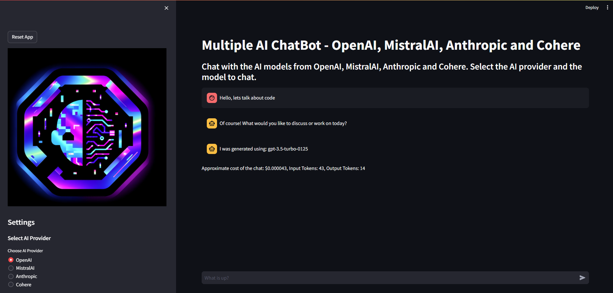

# Multiple AI ChatBot - OpenAI, MistralAI, Anthropic and Cohere
CodeChatBot is a chatbot that can chat with you about code, programming, and technology. It uses multiple AI models to generate responses.
The chatbot is built using OpenAI, MistralAI, Anthropic, and Cohere. It can answer questions, provide code examples, and help you with your coding problems, read documents, and more.

This is a small project of mine to get familiar with the writing streamlit apps and LLM's. Please feel free to reach out to me with how I can improve this code as I am a hobbyist coder and always looking to improve.

## Chatbot Interface


## Features
- Chat with the chatbot about code, programming, and technology
- Get answers to your questions
- Get code examples
- Get help with your coding problems
- Read documents (pdf, docx, txt, etc.)
- Read URLs (web pages)
- Swap between different AI models during the conversation

## How to Install
1. Clone the repository
2. Install the requirements
3. Run the chatbot

```bash
git clone https://github.com/CodeHalwell/code_chat_bot.git
cd code_chat_bot
pip install -r requirements.txt
touch .env
echo OPENAI=YOUR_KEY_GOES_HERE >> .env
echo MISTRAL=YOUR_KEY_GOES_HERE >> .env
echo ANTHROPIC=YOUR_KEY_GOES_HERE >> .env
echo COHERE=YOUR_KEY_GOES_HERE >> .env
streamlit run main.py
```

## Code Structure
- `main.py`: Main file to run the chatbot
- `document_loader.py`: Load documents from different sources

# File Structure
```
./previous_chats - Used to store and load previous chat logs
./upload_docs - Staging area for uploaded documents

```

# How to Use
1. Start the chatbot by running `streamlit run main.py`
2. Select the AI provider you want to use
3. Select the model you want to use
4. Set the temperature and max tokens
5. Select a system prompt depending on your purpose (e.g., ask a question, get code examples, read documents etc.)
6. Load a document or URL if needed (optional)
7. Start chatting with the chatbot
8. Swap between different AI models during the conversation
9. Save the chat log if needed wih the save state button (with a file name)
10. You can also load previous chat logs by typing the file name in the load state box
11. To clear the chat log, click the reset app button in the top left corner
12. Monitor the costs incurred (approximate amount in $) by the chatbot in the lower left corner

# How to Contribute
1. Fork the repository
2. Create a new branch
3. Make your changes
4. Push your changes to your branch
5. Create a pull request
6. Wait for the pull request to be reviewed
7. Merge the pull request
8. Celebrate your contribution

# License
This project is licensed under the MIT License - see the [LICENSE](LICENSE) file for details.

# Acknowledgements
- [OpenAI](https://openai.com)
- [MistralAI](https://mistral.ai)
- [Anthropic](https://anthropic.com)
- [Cohere](https://cohere.ai)

# Contact
If you have any questions or suggestions, feel free to contact me.


